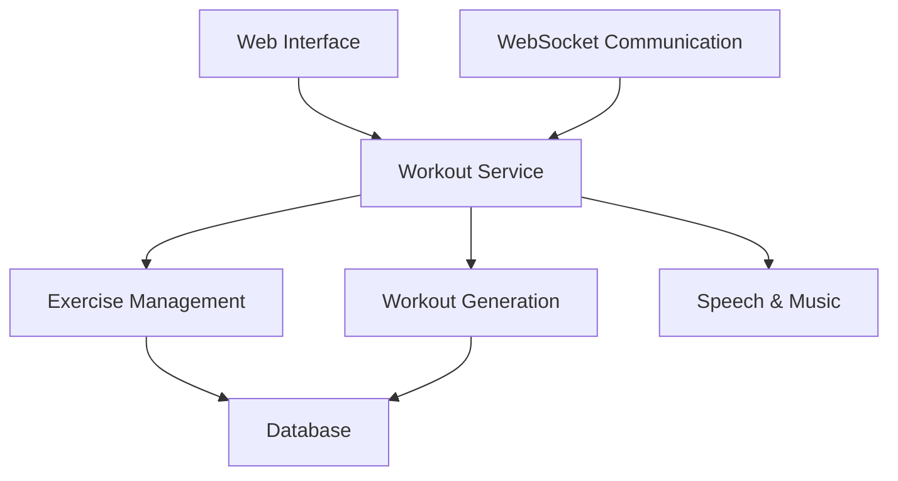

# System Patterns: Nerdouts

## Architecture Overview

Nerdouts follows a layered architecture with clear separation of concerns:

## Core Components

### 1. Data Models
- **Exercise**: The fundamental unit representing a single exercise with attributes like name, category, time, repetitions, and sides.
- **Workout**: A collection of exercises forming a complete workout session.
- **WorkoutExercise**: A join entity connecting workouts and exercises with specific parameters.
- **StaticWorkout**: Predefined workouts stored in the database.
- **ExerciseCategory**: Enumeration of exercise types (physical_therapy, stretch, strength, rolling).

### 2. Workout Generation
- **Static Workouts**: Predefined collections of exercises loaded from code or database.
- **Dynamic Workouts**: Algorithmically generated based on time constraints and category weights.
- The generation algorithm ensures balanced distribution across categories according to specified weights.

### 3. Web Interface
- FastAPI-based web server providing HTML templates and API endpoints.
- WebSocket communication for real-time workout progress and control.
- Responsive templates for workout selection, configuration, and execution.

### 4. Execution Engine
- **WorkoutService**: Coordinates the execution of workouts.
- **Speech Engine**: Provides voice announcements for exercises.
- **Music Integration**: Controls music playback during workouts.

## Key Design Patterns

### 1. Repository Pattern
- Database access is abstracted through SQLAlchemy ORM.
- Models represent database entities with clear relationships.

### 2. Factory Pattern
- Workout generation creates workouts based on configuration parameters.
- Exercise instances are created from database records or JSON definitions.

### 3. Strategy Pattern
- Different workout generation strategies (static vs. dynamic).
- Configurable category weights for personalized workout composition.

### 4. Observer Pattern
- WebSocket connections observe workout progress.
- UI updates based on exercise transitions and workout state.

### 5. Context Manager Pattern
- Application context manages database connections and configuration.
- Ensures proper resource cleanup and consistent state.

## Critical Implementation Paths

### Exercise Flow
1. Exercises are defined in JSON or database.
2. Loaded into memory with proper categorization.
3. Selected for workouts based on criteria.
4. Executed with appropriate timing and instructions.

### Workout Generation Flow
1. User selects workout type (static or dynamic).
2. For static: Select from predefined workouts.
3. For dynamic: Specify time and category weights.
4. System generates workout meeting constraints.
5. Workout is presented to user for execution.

### Execution Flow
1. Workout exercises are sequenced.
2. Each exercise is announced via speech.
3. Music pauses during announcements.
4. Timers track exercise duration.
5. User can control flow (skip, pause, end).
6. Completed workout is recorded.

## Component Relationships

- **Exercise ↔ Category**: Each exercise belongs to a specific category.
- **Workout ↔ Exercise**: Many-to-many relationship through WorkoutExercise.
- **StaticWorkout ↔ Exercise**: Predefined collections of exercises.
- **Web Interface ↔ Workout Service**: Web interface triggers workout operations.
- **Speech ↔ Music**: Coordinated to provide seamless audio experience.

## Technical Decisions

1. **SQLAlchemy ORM**: Provides database abstraction and flexibility for different backends.
2. **FastAPI + Jinja2**: Modern web framework with template support for UI.
3. **WebSockets**: Real-time communication for workout progress.
4. **Text-to-Speech**: Platform-specific implementation for voice guidance.
5. **Spotify Integration**: External music service control via AppleScript.
